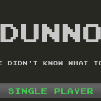
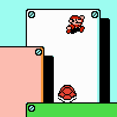
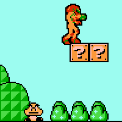
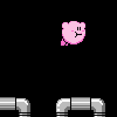
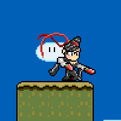
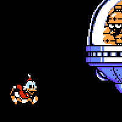

**dunno** is meant to be a modular platformer game engine. You should be
able to create and add characters and stages to it as you like.

It should be flexible enough to allow you to recreate some classic 
games' physics (e.g. Mario Bros, Metroid, etc. physics). Eventually it 
should get multiplayer (collaborative and/or competitive) capabilities. 
Maybe online functionality too, but that's far beyond now.

This project draws inspiration from the [MUGEN](http://www.elecbyte.com/mugen)
fighting game engine and the 
[Usatei flash animation](http://www.youtube.com/watch?v=lzXQghLrCVw) (and, by
extension, [Touhou Kaeidzuka ~ Phantasmagoria of Flower
View](http://en.wikipedia.org/wiki/Phantasmagoria_of_Flower_View)).

## Tools

dunno is being developed using the [LÖVE](https://love2d.org/) game engine, 
written in [Lua](http://www.lua.org/). 

Characters are written in Lua; stages are described using 
[Tiled Map Editor](http://www.mapeditor.org)'s format,
plus some Lua code.

## Screenshots

Remember, this is a work in progress. Click on an image to see it in full!
   

The title screen. Just to show that there's one.

Classic games' physics, such as Super Mario Bros 3, can be recreated. 
This stage has most of its enemies (and their interactions) 
implemented.

However, you can also play as other characters.

Kirby, flying on Metroid's Tourian level. Big levels such as Tourian can be
implemented, though they take a bit of loading time.

If you have the needed sprites, you can bring new characters to the game, such
as Bayonetta. You'll have to play a bit with their physics values to make them
feel right.

Stages with rooms specify a "transition mode" (scrolling, fade to black, etc) 
to use when moving from one room to the next.
